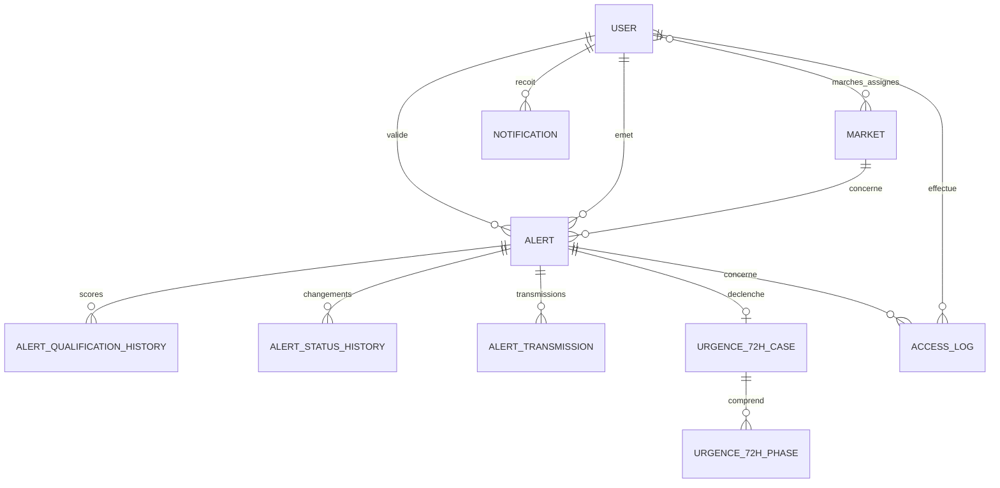

# Discours de présentation — Plateforme GEI
 TABLEAU CARTOGRAPHIE .
**Durée visée : 24 à 26 minutes, questions comprises jusqu’à 30 minutes.**  
**Format :** discours oral avec démonstration facultative de 4 à 5 minutes.  
**Public :** responsables, utilisateurs métiers, équipe technique et partenaires.

> Les mentions entre crochets sont des indications de présentation et ne sont pas à lire à voix haute. Le discours décrit le fonctionnement constaté dans le projet. Pour une présentation externe, ne pas projeter de vraies alertes, identités, mots de passe ni données sensibles.

## Déroulé minuté

| Temps | Séquence |
|---|---|
| 0–2 min | Ouverture et objectif |
| 2–5 min | De l’ancien processus à la plateforme |
| 5–10 min | Saisie et insertion d’une alerte |
| 10–14 min | Calcul, qualification et traitement |
| 14–17 min | Rôles et responsabilités |
| 17–22 min | Modèle de données et traçabilité |
| 22–26 min | Sécurité, fiabilité et limites |
| 26–28 min | Démonstration ou récapitulatif |
| 28–30 min | Conclusion et questions |

## Discours

### 1. Ouverture — 0 à 2 minutes

Mesdames et Messieurs, bonjour.

Je vous remercie de votre présence. En moins de trente minutes, je vais vous présenter la plateforme GEI : le besoin auquel elle répond, le parcours d’une alerte depuis sa saisie jusqu’à sa décision, les rôles des utilisateurs, l’organisation de la base de données et les mécanismes de sécurité qui encadrent son usage.

Le point de départ est très concret. Jusqu’ici, les informations étaient recueillies dans un formulaire rempli manuellement, puis reportées dans un fichier Excel. Le score et le niveau de priorité n’étaient pas calculés automatiquement. Cela demandait du temps, multipliait les ressaisies et rendait plus difficile l’harmonisation des analyses, le suivi des décisions et la reconstitution de l’historique TABLEAU CARTOGRAPHIE .

La plateforme transforme ce traitement en un parcours numérique structuré. Elle ne remplace pas le jugement des analystes et des responsables : elle organise l’information, applique une méthode de calcul commune, contrôle les accès et rend les décisions plus traçables.

### 2. Du formulaire manuel au registre partagé — 2 à 5 minutes

Dans le processus antérieur, une même information pouvait être saisie une première fois sur le formulaire, puis recopiée dans Excel. Le calcul du score reposait sur une intervention humaine, et le suivi dépendait souvent de mises à jour manuelles du registre.

Avec la plateforme, l’alerte est saisie dans un formulaire guidé en six étapes. Les valeurs de classification sont sélectionnées dans des listes de référence, au lieu d’être écrites librement à chaque fois. Le système génère un code GEI, enregistre l’alerte dans la base relationnelle et calcule le score à partir des critères saisis. Les responsables consultent ensuite un registre filtrable, les tableaux de bord et l’historique.

Excel n’est pas supprimé du jour au lendemain. La plateforme sait importer un fichier Excel, en vérifier la structure, afficher une prévisualisation et demander confirmation avant l’import. Elle sait aussi produire des exports. Cette continuité facilite la reprise de données et le partage des rapports, tandis que le traitement quotidien se fait dans l’application.

La différence importante est donc la suivante : Excel devient un outil d’échange et de transition ; la plateforme devient le point de référence pour la saisie, le calcul, le suivi et la consultation, sous réserve que les procédures de l’organisation désignent bien cette base comme registre officiel.

### 3. Saisir et insérer une alerte — 5 à 10 minutes

Regardons le parcours d’une alerte, du point de vue de l’émetteur terrain.

Première étape : l’identification. L’utilisateur renseigne la date, le marché concerné et la zone, par exemple un port ou un corridor. La plateforme associe l’alerte à son émetteur et à son marché. Le code GEI est ensuite généré par le système selon un format qui inclut le marché, l’année et un numéro séquentiel.

Deuxième étape : le contenu. L’émetteur consigne un résumé exécutif, les références documentaires disponibles et la description de la situation. La qualité de cette étape est fondamentale : l’outil organise les faits, mais ne peut pas compenser une information source imprécise ou incomplète.

Troisième et quatrième étapes : la classification et la source. L’utilisateur choisit la catégorie de l’alerte, le type de source et renseigne les informations d’anonymisation. Les listes de référence permettent de conserver des termes communs entre les marchés.

Cinquième étape : la qualification initiale. L’utilisateur renseigne la fiabilité de la source, la crédibilité du contenu, le niveau d’urgence, l’impact et l’exploitabilité. Ces critères alimentent le calcul. Ils ne sont pas le résultat d’une décision automatique sur la véracité de l’information : ils représentent l’évaluation saisie par une personne habilitée.

Sixième étape : la relecture et la soumission. L’utilisateur vérifie son dossier avant de l’envoyer. Le formulaire contrôle les champs requis côté serveur, conserve un brouillon entre les étapes et ne considère pas le calcul affiché comme une validation métier.

[Démonstration facultative : ouvrir le wizard, montrer les six étapes sans enregistrer d’alerte réelle, afficher les listes de sélection et l’aperçu du score.]

Pour les organisations qui disposent déjà d’un registre Excel, le parcours d’import est également encadré : le fichier est analysé avant confirmation, les erreurs de format sont signalées, puis l’utilisateur confirme l’opération avec un jeton de sécurité. Pour les imports importants, le traitement peut être placé en arrière-plan. L’import ne doit pas être présenté comme une validation automatique de la qualité métier des données : il vérifie et transfère des valeurs, il ne certifie pas leur exactitude.

### 4. Calcul et traitement de l’alerte — 10 à 14 minutes

La plateforme applique une formule de score définie dans le service métier : score GEI égal à fiabilité multipliée par crédibilité convertie, puis augmenté des points d’urgence, d’impact et d’exploitabilité. Les conversions suivent la matrice de qualification. Le score et le niveau de priorité sont recalculés côté serveur lors de la création ou de la modification des critères. Ils ne sont donc pas simplement repris d’une valeur tapée dans le navigateur.

Le seuil critique configuré par défaut est de 18 points, avec les seuils Élevé à partir de 14 et Modéré à partir de 10. Il faut bien parler de score **supérieur ou égal à 18**, et non strictement supérieur à 18. Le seuil critique peut être configuré dans les règles de l’application.

Le score ne prend pas la décision à la place du responsable. Il oriente la priorité, alimente les notifications et peut déclencher des règles d’escalade. En particulier, un score critique ne signifie pas à lui seul qu’une procédure Urgence 72 h est ouverte. La règle applicative exige aussi que l’alerte soit classée « 72 h » et qu’elle ait le statut « validée ». Une fois ces conditions réunies, le moteur d’escalade crée le dossier Urgence 72 h et ses phases. Une activation manuelle existe aussi pour un utilisateur autorisé, avec justification obligatoire.

Le traitement suit ensuite un cycle de statuts : nouvelle alerte, traitement, demande de complément ou investigation, attente de validation, validation, transmission, suivi, archivage ou clôture. Le responsable peut demander un complément ou rejeter le dossier avec un motif selon le parcours prévu. Les changements de statut et les recalculs peuvent être historisés. Des notifications orientent les actions vers les utilisateurs concernés.

Pour être parfaitement transparent, certaines automatisations dépendent aussi du fonctionnement de l’environnement : le worker de messages doit être actif pour traiter les messages asynchrones, et la commande de surveillance SLA doit être planifiée et exécutée pour assurer les rappels temporels. La présence du code ne suffit pas à prouver que ces processus tournent effectivement en production.

### 5. Rôles et responsabilités — 14 à 17 minutes

La plateforme distingue plusieurs profils.

- L’émetteur terrain crée et suit ses alertes ; sa visibilité est limitée à ses propres dossiers selon les règles d’accès.
- Le PFT, ou point focal technique, traite les alertes relevant des marchés qu’il gère. Il peut qualifier, prendre une décision de validation ou de rejet et coordonner les suites selon les permissions applicables.
- SAHOLTY dispose d’une vue régionale et de droits élargis dans l’application.
- Le Secrétariat GEI et le Comité AIT ont des accès adaptés à leurs missions de consultation ou de pilotage.
- Le Super Administrateur gère la configuration et dispose de permissions étendues.

La règle de gouvernance à retenir est le moindre privilège : chaque personne doit disposer uniquement des accès nécessaires à sa fonction. Le contrôle ne repose pas seulement sur le fait qu’un bouton soit visible ou masqué dans l’interface ; les contrôleurs et les voters vérifient également les droits côté serveur. Pour les PFT, la portée par marché est prise en compte.

Dans l’implémentation actuelle, SAHOLTY et Super Administrateur bénéficient de droits larges dans le voter des alertes. La décision opérationnelle doit donc être accompagnée d’une attribution prudente de ces comptes, d’une revue périodique des rôles et d’une définition claire des suppléances. Il faut également vérifier que la politique souhaitée par l’organisation correspond bien à cette configuration avant l’ouverture à tous les utilisateurs.

### 6. Schéma de la base de données — 17 à 22 minutes

Voici la structure essentielle, sans entrer dans les détails de chaque colonne.

Au centre se trouve la table `alert`. Elle porte le code GEI, le marché, l’émetteur, le contenu, les critères de qualification, le statut et le résultat du calcul. Les faits et les hypothèses analytiques sont stockés séparément, ce qui aide à ne pas confondre observation et interprétation.

La table `user` contient les comptes, les rôles et les éléments de rattachement aux marchés. Les marchés sont eux-mêmes des entités référencées. Les relations permettent à un responsable de couvrir un ou plusieurs marchés et à l’application de filtrer la consultation selon l’affectation.

Les tables d’historique de qualification et d’historique de statut conservent respectivement les valeurs de score avec un instantané des critères, et les transitions de statut avec l’utilisateur concerné. `alert_transmission` enregistre le suivi des transmissions. `urgence_72h_case` est lié à une alerte, avec ses phases et leurs échéances. Enfin, `notification` et `access_log` servent à la communication interne et à la traçabilité.

Cette séparation évite de transformer le classeur en une immense table difficile à maintenir. Elle permet de relier clairement une alerte à son marché, son auteur, ses décisions, ses transmissions et son historique. Les migrations versionnent l’évolution de la structure, ce qui rend les modifications de schéma contrôlables.

### 7. Sécurité et fiabilité — 22 à 26 minutes

La sécurité doit être abordée avec sérieux et sans promesse absolue. Aucun logiciel ne peut être déclaré « totalement sécurisé ». Ce que nous pouvons présenter, ce sont les mesures visibles dans l’application et les conditions nécessaires pour les rendre efficaces en exploitation.

Premièrement, l’accès est authentifié par compte. Symfony utilise un mécanisme de hachage des mots de passe : le mot de passe n’est pas stocké comme texte lisible. La connexion inclut une protection CSRF et une limitation des tentatives, configurée à cinq essais sur quinze minutes. La déconnexion invalide la session et exige également un jeton CSRF.
 TABLEAU CARTOGRAPHIE .
Deuxièmement, les autorisations sont fondées sur les rôles et le périmètre métier. Un agent ne doit pas pouvoir consulter librement toutes les alertes ; un PFT agit dans les marchés qui lui sont attribués. Des contrôles côté serveur protègent les opérations sensibles comme la consultation, la validation, la transmission, l’import ou la suppression logique. Les opérations POST concernées utilisent des jetons CSRF.

Troisièmement, plusieurs éléments contribuent à la traçabilité : les journaux d’accès, l’historique des décisions, les changements de statut et les instantanés de score. Une alerte retirée du registre utilisateur est en principe marquée comme supprimée logiquement plutôt qu’effacée immédiatement de la base. Cela facilite les audits, sous réserve que la politique de conservation et les droits d’accès aux journaux soient définis.

Quatrièmement, l’application prend en charge l’authentification à deux facteurs TOTP et stocke le secret TOTP sous forme chiffrée. Il faut cependant distinguer « fonctionnalité disponible » et « imposée à tous » : la politique de déploiement doit vérifier l’activation et l’exigence effective du second facteur pour les comptes concernés.

Enfin, il ne faut pas confondre ce chiffrement ciblé avec le chiffrement de toutes les alertes. Les mesures observées ne prouvent pas à elles seules que le contenu de la base entière est chiffré au repos, que les sauvegardes sont chiffrées ou que les échanges sont protégés par TLS dans l’environnement réellement déployé. Ces protections relèvent aussi de la configuration du serveur, de la base de données, du stockage, du réseau et des sauvegardes.

Pour une mise en service fiable, je recommande donc de confirmer avant production : HTTPS obligatoire, secrets de production robustes et hors du dépôt, sauvegardes chiffrées avec tests de restauration, 2FA imposée aux profils sensibles, contrôle régulier des comptes et des marchés attribués, supervision du worker et du cron SLA, journalisation surveillée, procédure de gestion d’incident et tests de sécurité indépendants. La plateforme fournit des fondations techniques ; la gouvernance et l’exploitation complètent la sécurité.

### 8. Conclusion — 26 à 28 minutes

Pour conclure, la plateforme GEI fait évoluer un processus auparavant manuel — formulaire, retranscription dans Excel et absence de calcul automatisé — vers une chaîne numérique structurée : saisie guidée, calcul centralisé, priorisation, validation humaine, notifications, registre filtrable et historique.

Le changement n’est pas uniquement technologique. Il améliore la cohérence des dossiers et donne aux responsables une meilleure capacité de suivi, tout en maintenant la décision finale entre les mains des personnes habilitées. Le score aide à prioriser ; il ne remplace ni l’analyse, ni la validation, ni la responsabilité humaine.

La sécurité, elle aussi, est un travail continu. Les rôles, les contrôles serveur, les protections de connexion et la traçabilité sont importants ; ils doivent être accompagnés d’une configuration de production rigoureuse, d’une discipline sur les accès et d’une supervision opérationnelle.

Notre prochaine étape est de valider le parcours avec les utilisateurs, de confirmer les règles de rôles et de marchés, puis de vérifier les exigences de sécurité et d’exploitation avant de généraliser l’usage.

Je vous remercie. Je suis maintenant disponible pour vos questions.

## Repères rapides pour le présentateur

- Dire **« score supérieur ou égal à 18 »** : le code applique `>= 18`.
- Ne pas dire qu’un score critique suffit à activer l’Urgence 72 h : il faut aussi urgence `72h` et statut `validée`.
- La validation relève du PFT sur son périmètre ; le voter accorde aussi des droits étendus à SAHOLTY et au Super Administrateur.
- Ne pas présenter le TOTP comme obligatoire sans vérifier la politique de production.
- Ne pas affirmer que toutes les données d’alerte ou toutes les sauvegardes sont chiffrées : le chiffrement constaté concerne le secret TOTP.
- Ne pas projeter les comptes, mots de passe de fixtures, identifiants ou données réelles. Utiliser un environnement et des données de démonstration.
- Avant une démonstration, confirmer que la base de test est disponible et que les travailleurs Messenger et la planification SLA nécessaires sont actifs